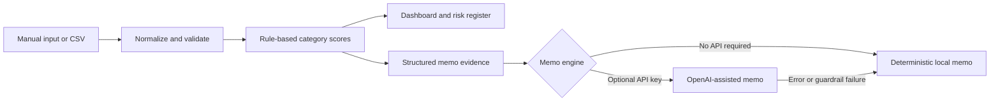

# AI Venture Capital Investment Screener

A polished, educational Streamlit application that converts raw startup information into an explainable first-pass VC screen, risk register, diligence plan, and structured investment memo.

The project is designed to answer one question:

> **Is this startup worth deeper diligence, and what evidence should be investigated next?**

It does not make investment decisions or predict company outcomes.

## Product tour

### Startup Screener

- Enter a company manually, load one of four fictional profiles, or upload compatible CSV data.
- Capture company, market, product, traction, unit-economics, financial, team, competitive, and risk evidence.
- Keep truly missing metrics distinct from reported zeros.
- Validate required fields, numeric ranges, and inconsistent capitalization inputs.

### VC Scoring Dashboard

- Compare nine explainable 0–100 category scores.
- Inspect every rule-based rationale, category weight, and evidence gap.
- Review an overall attractiveness screen separately from the final risk rating.
- Explore radar, bar, and risk-severity visualizations.
- Generate adaptive diligence questions from the supplied evidence.

### Investment Memo

- Generate a complete local memo without an API key or network request.
- Optionally synthesize the same structured evidence through the OpenAI Responses API.
- Fall back locally if the key is missing, the API fails, the response is empty, or language guardrails fail.
- Preview the exact structured payload and download the result as Markdown.

## Application flow



## Quick start

### Requirements

- Python 3.9 or newer
- `pip`
- An OpenAI API key only if you want AI-assisted memo generation

### Installation

```bash
git clone https://github.com/rdravid2005/VC-Startup-Screening-Investment-Memo-Project.git
cd VC-Startup-Screening-Investment-Memo-Project
python3 -m venv .venv
source .venv/bin/activate
python -m pip install -r requirements.txt
cp .env.example .env
streamlit run app.py
```

Open the local URL printed by Streamlit, normally `http://localhost:8501`.

Windows PowerShell activation:

```powershell
.venv\Scripts\Activate.ps1
```

## Optional OpenAI configuration

The app works completely without an API key. To enable the AI-assisted engine, add values to your local `.env`:

```dotenv
OPENAI_API_KEY=your_api_key_here
OPENAI_MODEL=gpt-4.1-mini
```

`.env` and `.streamlit/secrets.toml` are ignored by Git. Never place a real secret in `.env.example` or source code.

In AI-assisted mode, the normalized startup profile and calculated scorecard are sent to the configured OpenAI API account. The API request sets `store=False`; users should still avoid entering confidential information unless their data-handling requirements permit it.

## Scoring methodology

Version 1 uses documented screening heuristics, not machine learning. Each category returns a score, label, rationale, and evidence gaps.

| Category | Weight | Example evidence |
|---|---:|---|
| Market Opportunity | 15% | Addressable market, market growth, supporting context |
| Product / Differentiation | 12% | Problem clarity, product detail, differentiation thesis |
| Traction | 18% | Revenue, growth, customers, retention |
| Business Model Quality | 10% | Revenue structure, recurrence, gross-margin support |
| Unit Economics | 12% | Gross margin, LTV/CAC, retention |
| Founder / Team Strength | 10% | Relevant operating evidence and role coverage |
| Competitive Positioning | 8% | Competitor mapping and differentiation |
| Financial Health | 10% | Runway, burn efficiency, funding |
| Risk Resilience | 5% | Severity and count of deterministic risk flags |

The overall score is the weighted sum of these categories. A high score does not remove risk, so the dashboard also presents a separate `Low`, `Moderate`, `Elevated`, or `High` risk rating.

Score labels:

| Score | Label |
|---:|---|
| 80–100 | Strong |
| 60–79 | Promising |
| 40–59 | Needs diligence |
| 20–39 | Weak / high risk |
| 0–19 | Critical concern |

Thresholds are intentionally readable in [`src/scoring_model.py`](src/scoring_model.py). They are illustrative and have not been statistically validated against venture outcomes.

## Fictional sample data

[`sample_data/sample_startups.csv`](sample_data/sample_startups.csv) contains four fictional profiles designed to exercise different score and risk patterns:

- AtlasGrid — industrial energy intelligence
- LedgerLoop — lender monitoring workflows
- CareRoute — specialty-clinic referral automation
- ParcelMint — regional delivery marketplace

No real private-company data is bundled. A complete demonstration memo for AtlasGrid is available at [`results/example_investment_memo.md`](results/example_investment_memo.md).

For uploads, use the sample CSV headers as the template. The required columns are `startup_name`, `product_description`, and `target_customer`; other known fields are optional, and unknown columns are ignored.

## Repository structure

```text
.
├── app.py                         # Streamlit navigation and page composition
├── src/
│   ├── startup_inputs.py          # Schema, normalization, validation, form, CSV loading
│   ├── scoring_model.py           # Scores, weights, rationales, flags, questions
│   ├── memo_generator.py          # Structured prompt, Responses API, guarded fallback
│   ├── visualizations.py          # Reusable Plotly figures
│   └── utils.py                   # Parsing, formatting, and safe math helpers
├── sample_data/
│   └── sample_startups.csv        # Four fictional startup profiles
├── results/
│   └── example_investment_memo.md # Checked-in demonstration output
├── tests/                         # Data, scoring, memo, and UI-flow tests
├── notes/development_notes.md      # Architecture decisions and interview notes
├── APP_OUTLINE.md                 # Scope, guardrails, and roadmap
└── requirements.txt
```

## Testing

Run the complete suite:

```bash
python -m pytest -q
```

The tests cover:

- Missing-value and numeric normalization
- CSV schema and row validation
- Score weights, bounds, directionality, and risk flags
- Structured memo payloads and all required sections
- API client injection, no-key fallback, and output guardrails
- End-to-end Streamlit navigation from sample loading through memo generation

GitHub Actions runs the same suite on pushes and pull requests.

## Design principles

- **Evidence first:** Missing information becomes an explicit diligence gap.
- **Explainable scoring:** Every category can be traced to human-readable rules.
- **Risk separation:** Attractiveness and risk are related, but not collapsed into one claim.
- **Graceful degradation:** The product remains fully demonstrable without paid API access.
- **Guarded language:** Outputs discuss an investment case conditionally and avoid direct investment instructions.
- **Modular code:** Data, scoring, memo, and visualization logic are independently testable.

## Known limitations

- User-supplied metrics are not independently verified.
- Text scoring evaluates the presence and detail of evidence, not whether every qualitative claim is true.
- Market-size estimates and score thresholds are not benchmarked to a proprietary venture dataset.
- The app does not model dilution, ownership, fund returns, cap tables, or financing scenarios.
- There is no authentication, database, live company data, scraping, or pitch-deck parsing in Version 1.
- AI-assisted prose can vary and still requires human review.

## Potential Version 2 work

- Pitch-deck extraction with source-level citations
- Cohort, retention, and CAC-payback scenario analysis
- User-adjustable weights with sensitivity views
- Collaborative diligence checklists
- Structured market-research integrations
- Persistent company comparisons and portfolio views

## Portfolio positioning

Suggested resume bullet:

> Built a modular AI-powered venture capital screening application with Python, Streamlit, pandas, Plotly, and the OpenAI Responses API to evaluate fictional startups across market, traction, unit economics, competition, financial health, and risk, with explainable scoring, automated diligence questions, and guarded memo generation.

## Disclaimer

This project is for educational and portfolio demonstration purposes. It does not provide investment advice, recommend transactions, predict startup success, or replace independent legal, financial, commercial, or technical diligence.

## License

Released under the [MIT License](LICENSE).
